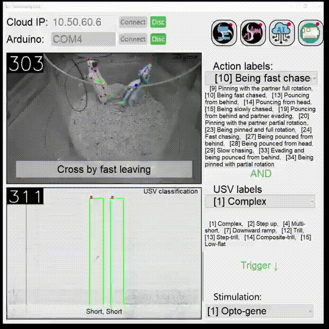
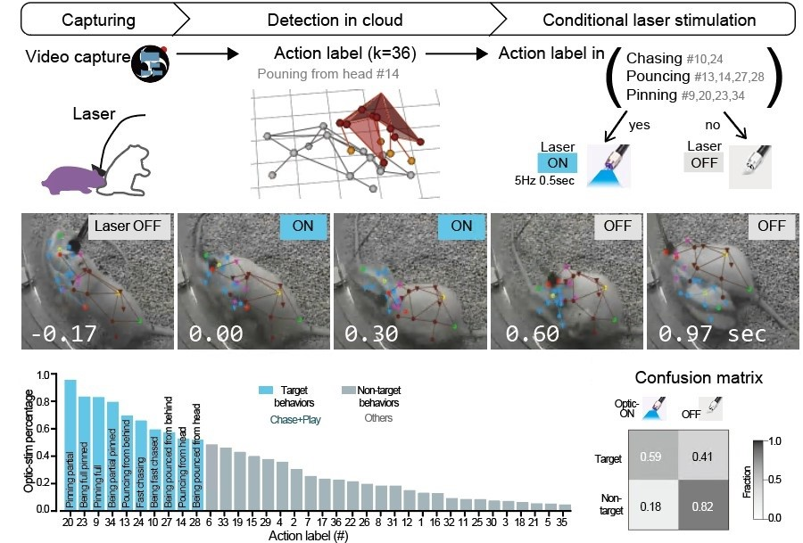
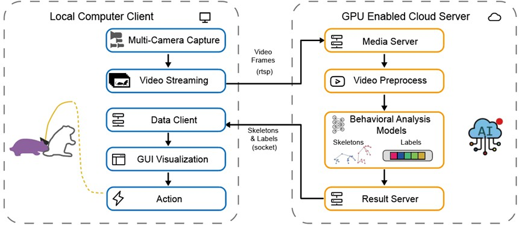

# Social-seq-live Client GUI
Link: [中文文档](README_CN.md)


Real-time analysis of social behaviors in two rats based on the Social-seq-live framework, and decide whether to provide closed-loop optogenetic stimulation based on behavioral labels. This is the client part of Social-seq-live and does not include server code.

> **Note**
> Rat ultrasonic vocalization (USV) analysis is currently in the testing phase and is not included in the main code. **The current release only includes the behavior recognition part**.




Record videos and stream them to the server; the server performs animal ID segmentation, keypoint reconstruction, behavior recognition, and generates labels; the client obtains the behavior labels and determines whether to execute optogenetic stimulation.



## Installing the Social-seq-live Client

First, download the code:

```bash
git clone https://github.com/chenxinfeng4/social-seq-live-client-GUI
cd social-seq-live-client-GUI*
```

Then install the dependencies:

```bash
pip install -r requirement.txt
```

## Running the Client Software

Navigate to the project directory and run `main.py`:

```bash
python main.py
```

## Brief Tutorial for Server and Client Usage

Refer to the following video (assets/MovieS5_realtime_prediction_240821.mp4):

<video controls>
  <source src="assets/MovieS5_realtime_prediction_240821.mp4" type="video/mp4">
  Your browser does not support the video tag.
</video>

## Real-time Behavior Analysis System Architecture



Considering the limited performance of computers in experimental rooms, which makes it difficult to smoothly run optimized models, this project adopts cloud computing power. Data is uploaded to a remote high-performance deep learning server through Ethernet, utilizing its additional GPU resources (4× NVIDIA RTX3090). The connection between the client computer and the server is stable with high network quality, meeting the network performance requirements for cloud computing.

This project has developed a new computing architecture consisting of two nodes: a client computer and a server. The client computer is responsible for collecting video data and transmitting it to the cloud server. The server executes the animal behavior analysis process and sends the results back to the client computer, which then decides whether to provide optogenetic stimulation.